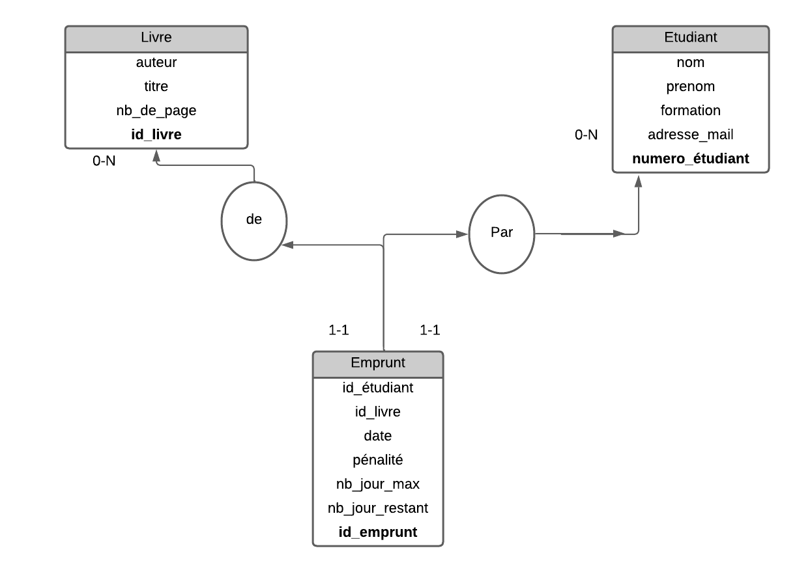
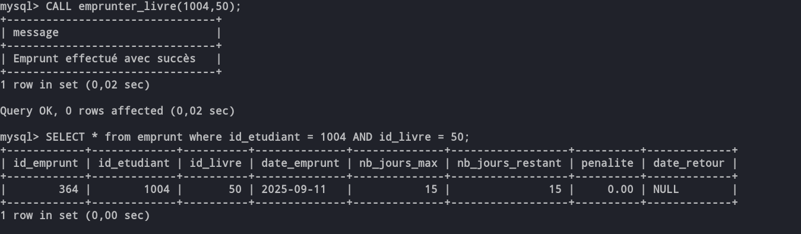
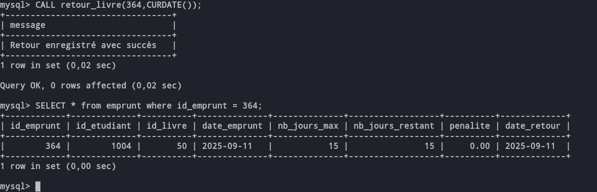

# 📚 BU-Management-System  

## 🎯 Objectif  
Ce projet consiste à créer un système de gestion d'une bibliothèque universitaire permettant de gérer les **livres**, les **étudiants** et les **emprunts**.  

Il a pour but de mettre en pratique les notions suivantes :  
- **SGBD et modélisation relationnelle**  
- **Programmation procédurale (PL/SQL)** avec procédures et fonctions  
- **Déclencheurs (triggers)** pour assurer la cohérence et la sécurité des données  
- **Index** pour améliorer les performances des requêtes  
- **Gestion des transactions (ACID)**  
- **Optimisation des requêtes et analyse des plans d'exécution**  

---

## 🗂️ Schéma relationnel  
  

### 🔎 Explication  
La base de données comporte 3 tables principales :  

- **Livre** : contient les informations nécessaires sur chaque livre (titre, auteur, disponibilité, etc.).  
- **Etudiant** : représente les étudiants (id, nom, prénom, numéro étudiant, etc.).  
- **Emprunt** : table pivot qui gère les emprunts et retours de livres (id_emprunt, id_etudiant, id_livre, dates, pénalités, etc.).  

---

## ⚙️ Installation et utilisation  
1. Créer la base de données :  
   ```sql
   CREATE DATABASE bu_universitaire;
   USE bu_universitaire;
   ```
2. Importer les tables à partir du script fourni.  
3. Créer les procédures stockées (`emprunter_livre`, `retour_livre`, etc.).  
4. Tester avec des appels aux procédures.  

---

## 📝 Exemples de requêtes  

### 📖 Emprunter un livre  
Appel de la procédure avec un numéro d’étudiant et un identifiant de livre :  
```sql
CALL emprunter_livre(1004, 50);
```

Requête SQL exécutée en interne :  
```sql
INSERT INTO emprunt(
    id_emprunt, id_etudiant, id_livre, date_emprunt, nb_jours_max, nb_jours_restant, penalite, date_retour
) 
VALUES (
    NULL, 1004, 50, CURDATE(), 15, 15, 0.0, NULL
);
```

Résultat attendu :  
  

---

### 🔄 Retourner un livre  
Appel de la procédure avec l’`id_emprunt` et la date de retour :  
```sql
CALL retour_livre(364, CURDATE());
```

Résultat attendu :  
  

---

### ⚠️ Gestion des erreurs (exemple)  
Si l’étudiant n’existe pas ou si le livre n’est pas disponible :  
```sql
CALL emprunter_livre(9999, 50);
```

Résultat :  
```
Livre non disponible ou étudiant inexistant
```

---

## ✅ Conclusion  
Ce projet m’a permis de :  
- mettre en pratique la **modélisation relationnelle** et la **programmation PL/SQL**,  
- comprendre l’importance de la **gestion des transactions** pour garantir la cohérence,  
- utiliser des **déclencheurs** et **index** pour améliorer la sécurité et les performances.  

À l’avenir, j’aimerais travailler sur des bases de données plus complexes, incluant par exemple des **rôles utilisateurs**, des **vues matérialisées** et des **optimisations avancées**, afin de renforcer encore davantage mes compétences.  